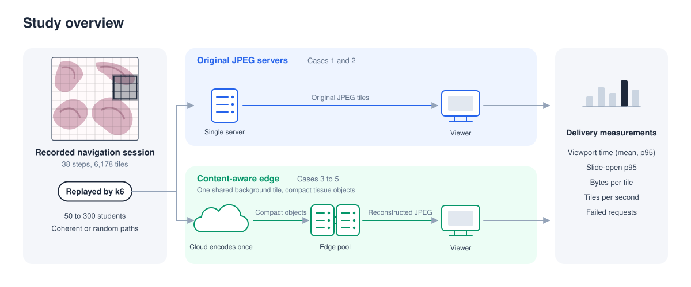

# Content-Aware Edge Delivery of Whole-Slide Images for Pathology Education

This repository accompanies the paper **Content-Aware Edge Delivery of Whole-Slide Images for Pathology Education**. It contains the delivery measurements, replay traces, and validation script for a class-scale whole-slide-image study.



Cases 1 and 2 served original JPEG tiles; Cases 3 to 5 served JPEG tiles reconstructed at an edge.

## Study design

| Case | Serving configuration | Client-facing tiles | Client network |
| --- | --- | --- | --- |
| Case 1 | One 32-vCPU cloud server | Original JPEG | Remote 100-Mbit/s access link |
| Case 2 | One institutional main server | Original JPEG | Remote 100-Mbit/s access link |
| Case 3 | Symmetric edge pool, two 32-vCPU nodes | Reconstructed JPEG | Remote 100-Mbit/s access link |
| Case 4 | Mixed-capacity edge pool, 32+2 vCPU (Ours) | Reconstructed JPEG | Remote 100-Mbit/s access link |
| Case 5 | Same design on two campus edge nodes | Reconstructed JPEG | 1-Gbit/s campus network |

Each case contains:

- coherent and random-coordinate access;
- 50, 100, 150, 200, 250, and 300 concurrent students;
- three repetitions per pattern and student count.

This gives 36 runs per case and 180 runs overall. The working set was warm before every run. Students started new trace passes for six minutes, and a pass in progress could finish within a 600-second grace period in Cases 1 to 4 or a 30-second grace period in Case 5. Each student issued at most 64 concurrent tile requests. The request timeout was 600 seconds in Cases 1 to 4 and 60 seconds in Case 5. Student starts were spread over a window of 10 to 60 seconds. All servers ran Ubuntu Server 24.04 LTS, and the replay client ran Ubuntu 24.04 LTS. Edge nodes used 16,384 nginx connections per worker. During preparation, they could resolve an object through the local, peer, and cloud hierarchy.

## Files

| Path | What it contains |
| --- | --- |
| [`overview/study-overview.svg`](overview/study-overview.svg) | The overview diagram shown above. |
| [`results/case1/` to `results/case5/`](results/) | The 180 original k6 summary JSON files, grouped by serving case. |
| [`data/run_statistics.csv`](data/run_statistics.csv) | One row per run with experimental factors, latency, throughput, response size, and request accounting. |
| [`data/cell_summary.csv`](data/cell_summary.csv) | Mean, sample standard deviation, range, and individual values for the three runs in each cell. |
| [`data/payload_summary.csv`](data/payload_summary.csv) | Coherent-access response-size measurements at 50 students. |
| [`data/edge_pool_comparison.csv`](data/edge_pool_comparison.csv) | Case 3 and Case 4 failure counts, request-latency ranges, and completed-request ratios. |
| [`data/transport_probe.csv`](data/transport_probe.csv) | The 16-, 128-, and 512-connection probe observations. |
| [`workload/coherent.json`](workload/coherent.json) and [`workload/random.json`](workload/random.json) | The two replay workloads, each with 20 deterministic variants. |
| [`scripts/verify_results.py`](scripts/verify_results.py) | Checks the raw summaries, tables, request accounting, and headline results. |

## Replay workload

Both replay files contain 38 navigation steps, represented as request batches, 6,178 tile requests per pass, approximately 49 seconds of think time, and 20 deterministic variants generated with seed 42. A request batch contains 163 tiles on average and 770 at most.

- `coherent.json` preserves the recorded pan and zoom path.
- `random.json` preserves the step sizes, pyramid levels, think times, and request schedule while replacing tile coordinates with seeded random coordinates.

Tile positions are represented by pyramid-level offset and normalized coordinates.

## Measurement definitions

The run table includes mean request-batch time, request-batch p50 and p95, slide-open p95, mean bytes per successful tile response, tile TTFB p95, successful tile throughput, successful-response body rate, and recorded, successful, failed, and unclassified tile outcomes. It also records login failures and service-target attainment. The retained CSV fields `viewport_mean_s`, `viewport_p50_s`, and `viewport_p95_s` preserve the artifact's original names derived from the custom k6 metric `viewport_fill_ms`. They correspond to the manuscript's mean, p50, and p95 request-batch completion time and measure the time until a replayed k6 batch returned rather than browser rendering. In `cell_summary.csv`, a p95 row is the mean and sample SD of three **run-level p95 values**, not a p95 pooled across runs.

## Validate the artifact

Python 3.10 or later is sufficient. The script uses only the standard library.

```bash
python3 scripts/verify_results.py
```

The script checks:

- the complete 5 × 2 × 6 × 3 design;
- every published run value against its k6 summary JSON;
- every cell mean, sample SD, minimum, maximum, and repetition value;
- payload and edge-pool diagnostic tables;
- request accounting and the reported failure totals, and it prints the headline reductions reported in the paper.

A successful run ends with:

```text
Runs: 180
Recorded tile outcomes: 298,331,670
All checks passed.
```

## Source slides

The experiment uses a slide from the public [CAMELYON16 challenge](https://camelyon16.grand-challenge.org/).

## Citation

Please cite the accompanying paper:

> **Content-Aware Edge Delivery of Whole-Slide Images for Pathology Education**

## License

This artifact is released under the [Apache License 2.0](LICENSE).
